# Treasura User Guide

Treasura is a **desktop app for managing CCA members and payments, optimized for use via a Command Line Interface (CLI)** while still having the benefits of a Graphical User Interface (GUI).  
If you can type fast, Treasura can get your CCA management tasks done faster than traditional GUI apps.  
Treasura is primarily targeted towards CCA leaders and treasurers. 🎓💼


<!-- * Table of Contents -->
<page-nav-print />

--------------------------------------------------------------------------------------------------------------------
## 🚀 Quick start

1. Ensure you have Java `17` or above installed in your computer.<br>
   **Mac users:** Ensure you have the precise JDK version prescribed [here](https://se-education.org/guides/tutorials/javaInstallationMac.html).

2. Download the latest `.jar` file from [here](https://github.com/AY2526S1-CS2103T-W11-2/tp/releases).

3. Copy the file to the folder you want to use as the _home folder_ for your Treasura.

4. Open a command terminal, `cd` into the folder you put the jar file in, and use the `java -jar Treasura.jar` command to run the application.<br>
   A GUI similar to the below should appear in a few seconds. Note how the app contains some sample data.<br>
   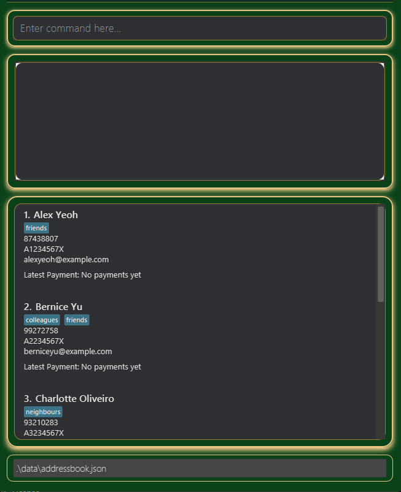

5. **Start using Treasura**  
   Type commands into the command box and press **Enter** to execute them.  
   For example, typing `help` and pressing Enter opens the help window.

---

### 💡 Example Commands to Try
* `add n/John Doe p/98765432 e/johnd@example.com m/A0123456X t/friend t/owesMoney` — Adds a contact named `John Doe` to Treasura.
* `archive 3` — Archives the 3rd member shown in the current list.

Refer to the [Features](#features) below for details of more commands.

---

## 🪙 Tutorial: Typical Treasurer Workflow using Treasura

Let’s walk through a day in the life of a CCA treasurer, Alex, as he uses **Treasura** to manage member and payment records for his CCA — *NUS Music Ensemble* — at the start of a new Academic Year.

<div markdown="block" class="alert alert-info">

**ℹ️ Note about indexes**

All `INDEX` values used in commands (e.g. `edit`, `archive`, `addpayment`) refer to the numbering shown in the **currently displayed list** in the GUI.  
If you run a command such as `listarchived` or `find`, the indexes will change according to that list.
</div>

---

### 🎓 A New Semester Begins

It’s the start of AY2025/2026, and Alex has not used Treasura in a while.  
He launches the app and wants to recall the available commands.

He types:

```
help
```

The **Help Window** appears, showing a list of all available commands and their formats.  
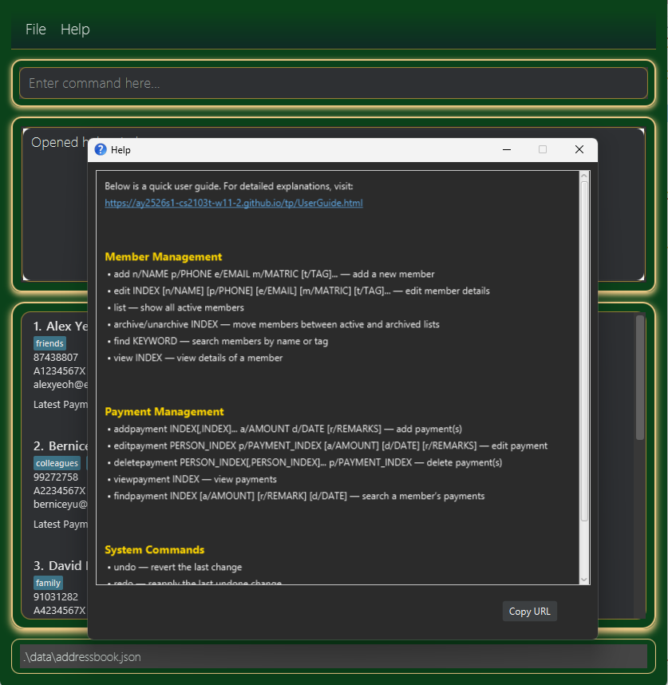

Now he’s ready to get started.

---

### 📦 Archiving Old Members

Some seniors have graduated, so Alex needs to archive them from the active member list.

First, he checks the current members:

```
list
```

He sees the following list:
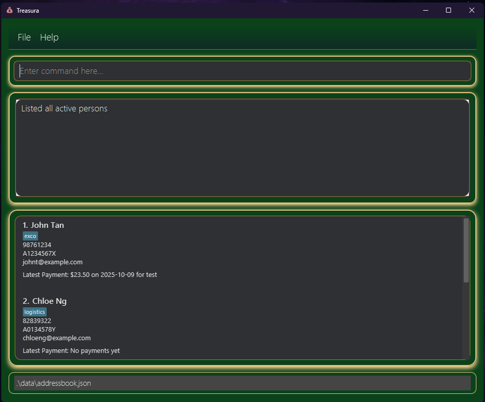

John and Chloe have graduated, so Alex archives them with:

```
archive 1,2
```

Now only the active members remain in the list.  
He can confirm the archived list using:

```
listarchived
```
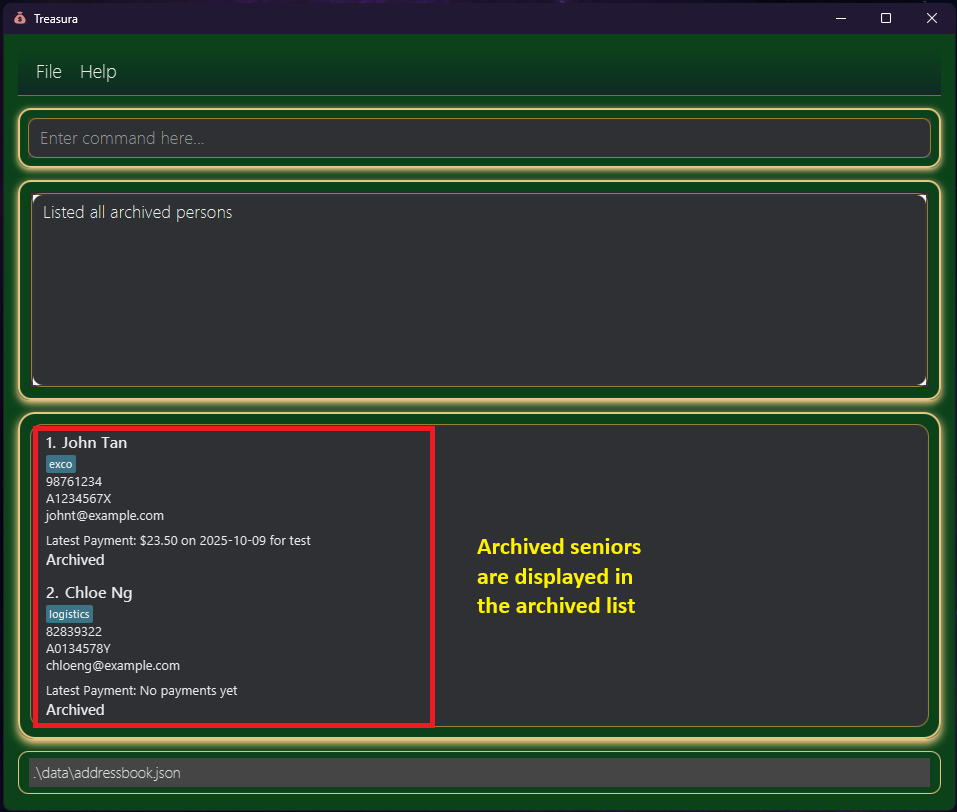

---

### 👥 Adding New Members

A new batch of Year 1 students has joined the CCA!  
Alex adds them to the system using the `add` command.

```
add n/Ethan Wong m/A0256789J p/98761234 e/ethanw@example.com t/performer
add n/Sarah Tan m/A0267890L p/96543210 e/sarahtan@example.com t/exco
add n/Lucas Koh m/A0268912M p/91234567 e/lucask@example.com t/logistics
```

To double-check, he runs:

```
list
```

and confirms that all new members appear correctly.
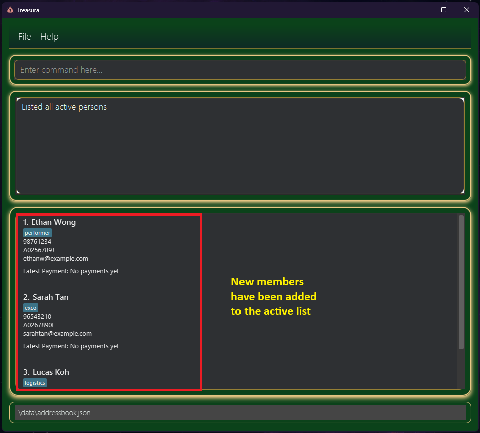

---

### 💰 Collecting CCA Shirt Payments

The CCA has ordered new shirts costing **$21.00 each**, and some members have already paid.  
Alex records these payments in one go for multiple members.

```
addpayment 1,2 a/21.00 d/2025-09-10 r/CCA Shirt Fee
```

(Here, `1` refers to Ethan, and `2` to Sarah, based on the current list.)
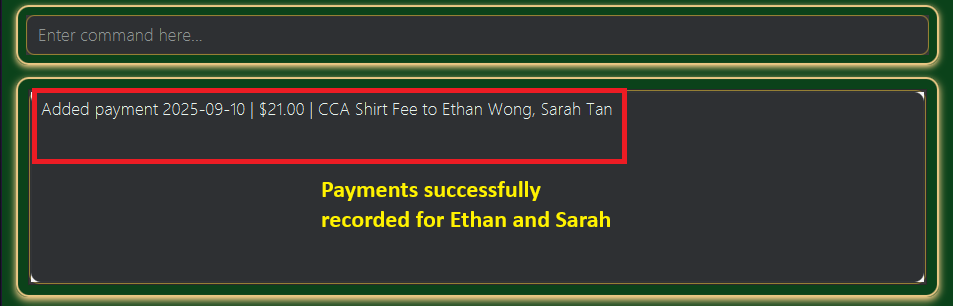

A few days later, Lucas pays as well, so Alex first finds Lucas in the list:
```
find Lucas
```

Then he records his payment separately:

```
addpayment 1 a/21.00 d/2025-09-12 r/CCA Shirt Fee
```

---

### 🔍 Checking if a Member Has Paid

Later, the president asks if *Ethan Wong* has already paid for the shirt.  
Alex first finds Ethan:

```
find ethan
```

To view Ethan's payments, Alex uses:

```
viewpayment 1
```

This shows Ethan’s payment history, confirming that he paid on **2025-09-10**.
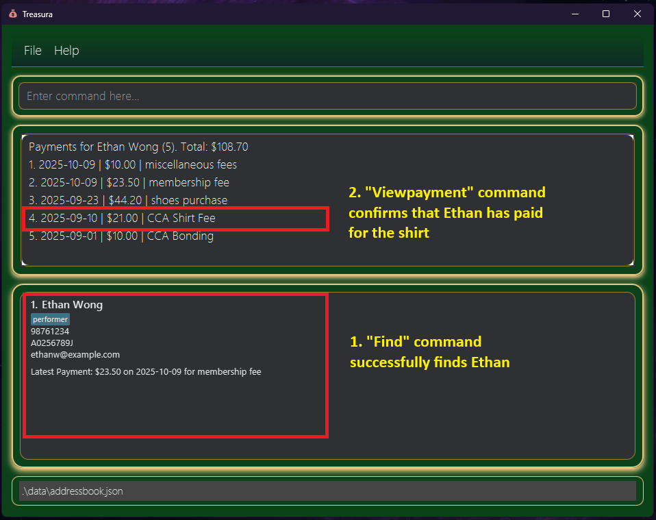

---

### 🧾 Finding a Specific Payment

Alex also wants to verify if Ethan has paid for *Membership Fees*,  
but the payment list is getting long. To locate the payment precisely, he runs:

```
findpayment 1 r/membership
```

This filters only Ethan’s payments that include the remark *“membership”*.
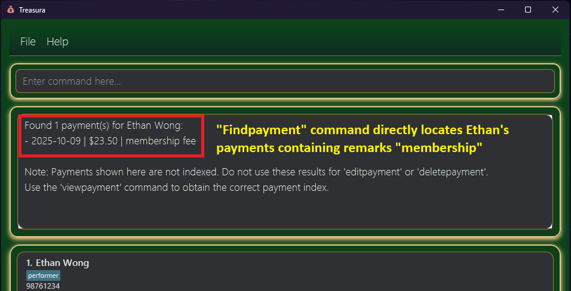

---

### ✏️ Correcting a Payment Error

After checking receipts, Alex realizes he made a mistake —  
Lucas actually paid **\$23.00** because he ordered a Large shirt,  
but Alex accidentally recorded it as **\$21.00**.

He first finds Lucas with `find lucas` command, then lists all his payments with `viewpayment 1` command. Lastly, he fixes the payment error with:

```
editpayment 1 p/1 a/23.00
```

This updates Lucas’s first payment record to reflect the correct amount.
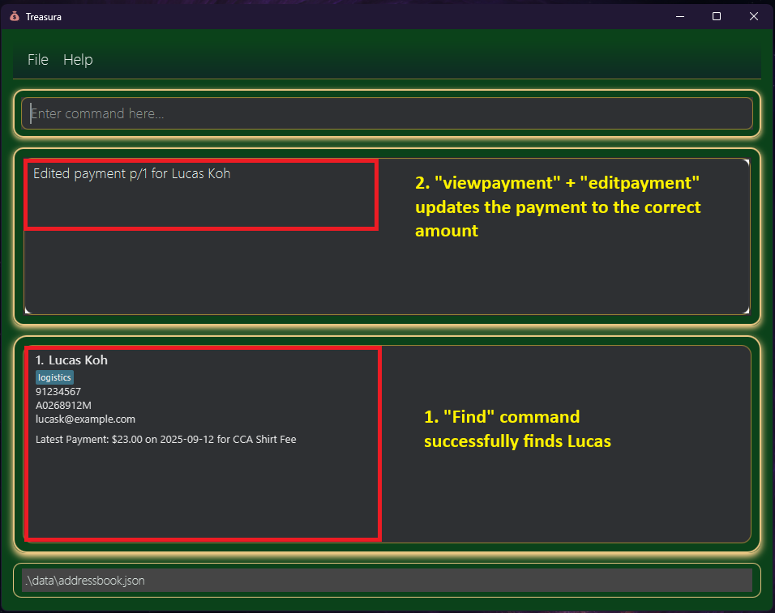

<div markdown="block" class="alert alert-info">

**ℹ️ Important note about payments**

When using `editpayment` or `deletepayment`, you must specify both the member’s index and the payment’s index (with a p/ prefix).
The payment index is the number shown after running the `viewpayment` command (not `findpayment`).

<box type="tip" seamless>

**Tip:** Always use `viewpayment` first to check a member’s payment list and `INDEX` before editing or deleting any payment!
</box>

</div>


---

### 😅 Fixing a Typo (Undoing a Command)

While editing a payment, Alex accidentally typed the wrong amount.  
No worries — he can simply undo his last change:

```
undo
```

The previous correct state is restored.  
Alex then re-applies the correct edit carefully.

Note: all commands can be undone using the 'undo' command

---

### 📊 Checking Total Collections

It’s nearing the end of the semester, and Alex wants to see **how much the CCA has collected in total** from all members — including membership fees, T-shirt payments, and event contributions.

He uses the `viewpayment all` command to quickly view every recorded payment across all members and calculate the **cumulative total**:

```
viewpayment all
```
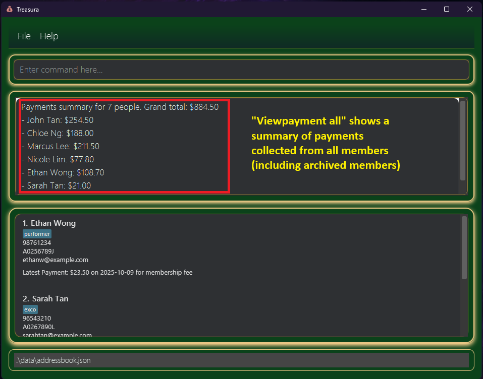

Treasura neatly lists all members and their respective total payment, together with a **grand total sum across all payments**.

This helps Alex double-check that all funds have been properly recorded before submitting his finance report.

Note that payment sums of archived members are included for financial consistency.


---

### ✅ End of the Day

By the end of the session, Alex has:

- Archived past members
- Added new members
- Recorded CCA shirt payments
- Verified and corrected payment records
- Used `undo` to revert a mistaken edit
- Checked the summary of payments and grand total

**All without his hands ever leaving the keyboard or opening an EXCEL spreadsheet!**

<box type="tip" seamless>

**Tip:** This workflow can easily be adapted for other events (e.g., workshop fees, camp payments, or ticketed performances). Just adjust the payment remarks and dates accordingly.
</box>

## ⚙️ Full Features

<box type="info" seamless>

**Notes about the command format:**<br>

* Words in `UPPER_CASE` are the parameters to be supplied by the user.<br>
  e.g. in `add n/NAME`, `NAME` is a parameter which can be used as `add n/John Doe`.

* Items in square brackets are optional.<br>
  e.g `n/NAME [t/TAG]` can be used as `n/John Doe t/friend` or as `n/John Doe`.

* Items with `…`​ after them can be used multiple times including zero times.<br>
  e.g. `[t/TAG]…​` can be used as ` ` (i.e. 0 times), `t/friend`, `t/friend t/family` etc.

* Parameters can be in any order.<br>
  e.g. if the command specifies `n/NAME p/PHONE_NUMBER`, `p/PHONE_NUMBER n/NAME` is also acceptable.

* Extraneous parameters for commands that do not take in parameters (such as `undo`, `list`, `exit`) will return an error if a parameter is given.<br>
  e.g. if the command specifies `undo 123`, it will cause an error.

<box type="warning" seamless>

**Caution:**  
`help` is the one exception to this rule, to provide leeway for unfamiliar users.<br>
</box>

* If you are using a PDF version of this document, be careful when copying and pasting commands that span multiple lines as space characters surrounding line-breaks may be omitted when copied over to the application.

</box>

<box type="tip" seamless>

**Tip:** For best results, always run `list` or `listarchived` before executing commands that use an **INDEX**.
</box>

---

### 🆘 Viewing Help : `help`

Shows a message containing all functions.


**Format:** `help`

---

## 🧍 Member Management

### Adding a Member: `add`
Adds a new member to Treasura.

**Format:**  
`add n/NAME m/MATRICULATION_NUMBER p/PHONE_NUMBER e/EMAIL [t/TAG]…​`

**Notes:**
* Each **Matriculation Number must be unique**.
* Must follow **NUS format**: `A` + 7 digits + uppercase letter (e.g., `A0123456X`).
* Tags are optional and can be used for roles (e.g., `exco`, `performer`).

**Examples:**
- `add n/John Doe m/A0123456X p/98765432 e/john@example.com`
- `add n/Betsy Crowe m/A0234567Y p/91234567 e/betsy@example.com t/exco t/publicity`

---

### Listing All Members: `list`
Displays all **active** members.

**Format:**  
`list`

<box type="warning" seamless>

**Caution:**
Adding an argument will cause an error!<br>

</box>

---

<!-- @@author Roshan1572 -->

### Finding Members: `find`
Finds members whose names or tags contain the given keywords.

**Format:**  
`find KEYWORD [MORE_KEYWORDS]`

**Notes:**
* The search is case-insensitive. e.g. `hans` will match `Hans`.
* The order of the keywords does not matter. e.g. `Hans Bo` will match `Bo Hans`.
* Only full words will be matched for names e.g. `Han` will not match `Hans`.
* When finding via tag, any case-insensitive, exact tag match will be shown (e.g. `OWESmoney` matches `owesMoney`, but `owe` does not).
* Members matching at least one keyword will be returned (i.e. `OR` search).
* Archived members are not included in the search results.

**Examples:**
* `find John` — returns all members with the name “John”.
* `find Alex David` — returns members named “Alex” or “David”.
* `find Alex family` — returns members named “Alex” or tagged with “family”.

**Expected output:**

  

<!-- @@author -->

---

### Editing a Member: `edit`
Edits details of an existing member.

**Format:**  
`edit INDEX [n/NAME] [m/MATRICULATION_NUMBER] [p/PHONE_NUMBER] [e/EMAIL] [t/TAG]…​`

**Notes:**
* **INDEX** refers to the member’s number in the displayed list.
* At least one field must be provided.
* Editing tags replaces all existing tags. Use `t/` to remove all tags.
* Updated Matriculation Numbers must remain **unique** and **NUS-formatted**.

**Examples:**
- `edit 1 p/91234567 e/johndoe@example.com`
- `edit 2 n/Betsy Crower t/`
- `edit 3 m/A0987654Z`

---

<!-- @@author Roshan1572 -->

### Archiving a Member: `archive`
Archives a member, hiding them from the active list but keeping their records.

**Format:**  
`archive INDEX[,INDEX]`

**Notes:**
* Run `list` first to check the indices before archiving members.
* Archives the person at the specified `INDEX`.
* The index **must be a positive integer** 1, 2, 3, …​

**Examples:**
- `archive 1` — archives the 1st member.
- `archive 1,3,4` — archives the 1st, 3rd and 4th members.

<box type="tip" seamless>

**Tip:** Members who have been archived still keep their payment and member details. Their details can be viewed via using `listarchived` and `viewpayment INDEX` or `view INDEX`.
</box>

**Expected output:**

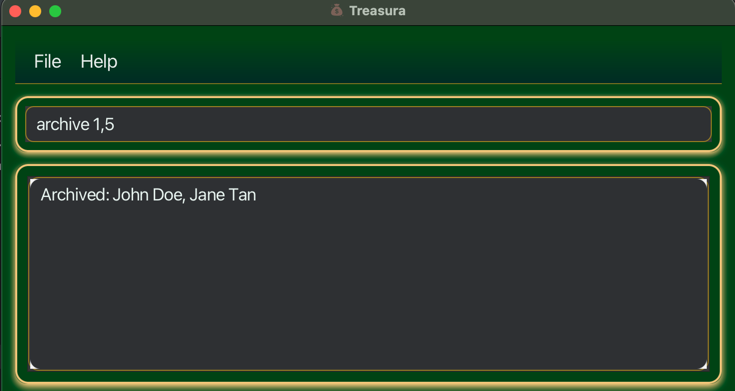

---

### Listing Archived Members: `listarchived`
Displays all archived members.

**Format:**  
`listarchived`

**Example:**
- `listarchived` — lists all archived members.

<box type="warning" seamless>

**Caution:**
Adding an argument will cause an error!<br>

</box>

**Expected output:**

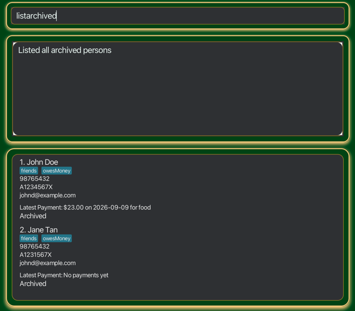

---

### Unarchiving a Member: `unarchive`
Restores an archived member to the active list.

**Format:**  
`unarchive INDEX[,INDEX]`

**Notes:**
* The index refers to the index number shown in the displayed person list, after using `listarchived`
* Restored members retain all previous details and payments.
* The index **must be a positive integer** 1, 2, 3, …​

**Examples:**
* `listarchived` followed by `unarchive 2` unarchives the 2nd person in the archived list.
* `listarchived` followed by `unarchive 1,2,4` unarchives the 1st, 2nd and 4th members in the archived list.

**Expected output:**


<!-- @@author -->

---

## 💰 Payment Management
<box type="info" seamless>
All payment commands function for archived members using indices from listarchived.<br>
</box>

### Adding a Payment: `addpayment`

Adds a payment to one or more members specified by their indices.

**Format:**  
`addpayment INDEX[,INDEX]... a/AMOUNT d/DATE [r/REMARKS]`

**Notes:**
* The index refers to the member(s) shown in the current displayed list.
* `a/AMOUNT` is the payment amount in dollars and cents (e.g., 25.00).
* `d/DATE` follows the `YYYY-MM-DD` format.
* `[r/REMARKS]` is optional for short notes such as “Membership Fee” or “CCA Shirt”.
* `addpayment` can be performed for archived members using indices from `listarchived`

**Examples:**
* `addpayment 1 a/20.00 d/2025-03-12 r/Membership fee`

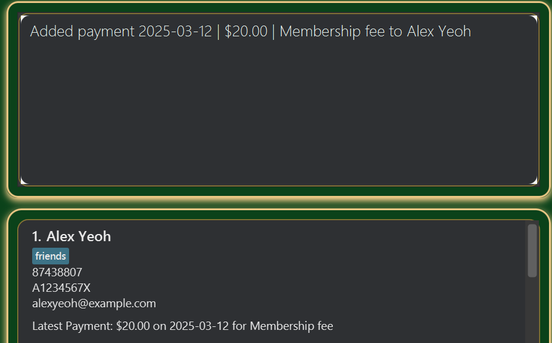

---

### Edit payment(s): `editpayment`

Edits an existing payment record for the specified member.

**Format:**
`editpayment PERSON_INDEX p/PAYMENT_INDEX [a/AMOUNT] [d/DATE] [r/REMARKS]`

**Notes:**
* `PERSON_INDEX` is the index of the member.
* `p/PAYMENT_INDEX` refers to the payment number listed in that member’s payment history.
* You can update one or more details: amount, date, or remarks.

**Examples:**
* `editpayment 1 p/2 a/30.00` — updates payment #2 for member #1 to $30.00.
* `editpayment 3 p/1 r/Corrected to event fee` — changes the remark for payment #1 of member #3.

---

### Viewing Payments: `viewpayment`
Displays payment details for a specific member, or for all members.

**Format:**  
`viewpayment INDEX`  
or  
`viewpayment all`

**Notes:**
* Use `viewpayment INDEX` to show all payments made by a single member.
* Use `viewpayment all` to view payments for every member in the current displayed list.
* If the payment history is too long, feel free to use `findpayment`.

**Examples:**
* `viewpayment 2` — shows all payments made by the 2nd member.
* `viewpayment all` — lists all recorded payments in current displayed list.

---

### Delete payment(s): `deletepayment`

Deletes an existing payment record from one or more members.

**Format:**
`deletepayment PERSON_INDEX[,PERSON_INDEX]... p/PAYMENT_INDEX`

**Notes:**
* `PERSON_INDEX` refers to the member(s).
* `p/PAYMENT_INDEX` refers to the payment number to delete from each listed member.

**Examples:**
* `deletepayment 1 p/2` — deletes payment #2 for member #1.
* `deletepayment 1,3 p/1` — deletes payment #1 for both members #1 and #3.

<box type="tip" seamless>

**Tip:** `deletepayment` can be reversed if `undo` is performed.
</box>

---

### Finding Payments: `findpayment`
Finds payments made by a specific member using filters.

**Format:**  
`findpayment INDEX [a/AMOUNT] [r/REMARK] [d/DATE]`

**Notes:**
* Search within a member’s payment history.
* Combine filters to narrow results.

**Examples:**
- `findpayment 1 a/50.00`
- `findpayment 2 r/Workshop`
- `findpayment 3 d/2025-03-15`


## ⚙️ General Commands

<!-- @@author Roshan1572 -->

### Undoing an action: `undo`

Undoes the most recent mutating action performed in Treasura.

**Format:** `undo`

**Notes:**
- Reverses the **last mutating command** (e.g., state-changing commands such as `add`, `edit`, `archive`, `unarchive`, `addpayment`, `editpayment`, `deletepayment`).
- You can `undo` a `redo` (i.e., undoing reverts the re-applied change).
- Non-mutating commands (e.g., `list`, `find`, `help`, `viewpayment`, `findpayment`) **do not** affect the undo history.

**Examples:**
```text
add n/Ali p/91234567 e/ali@example.com m/A1234567X
undo                      ← removes the person that was just added
archive 1,2,3
undo                      ← restores the archived members to active
addpayment 1 a/25.00 d/2025-10-21 r/membership
undo                      ← removes the payment just added
```
<box type="warning" seamless>

**Caution:**
Adding an argument will cause an error!<br>

</box>


---

### Redoing an action: `redo`

Reapplies the most recently undone mutating action.

**Format:** `redo`

**Notes:**
* Performs the last change that was previously undone using the `undo` command.
* If a new mutating command (e.g., `add`, `edit`, `archive`, `unarchive`, `addpayment`, `deletepayment`) is executed after an `undo`, the redo history is cleared.  
  This prevents redoing outdated actions after the user starts a new timeline.
* Non-mutating commands (e.g., `list`, `find`, `help`, `viewpayment`, `findpayment`) do **not** affect the redo history.

**Examples:**
```text
archive 2
undo                      ← restores member 2 to the active list
redo                      ← re-archives member 2 again

addpayment 1 a/50.00 d/2025-10-27
undo
redo                      ← re-applies the payment of $50.00 for person 1
```
<box type="warning" seamless>

**Caution:**
Adding an argument will cause an error!<br>

</box>

---


### Exiting the Program: `exit`
Closes Treasura.

**Format:**  
`exit`

<box type="warning" seamless>

**Caution:**
Adding an argument will cause an error!<br>

</box>

<!-- @@author -->

---

### Saving the data

Treasura data is saved in the hard disk automatically after any command that changes the data. There is no need to save manually.

### Editing the data file

Treasura data is saved automatically as a JSON file `[JAR file location]/data/addressbook.json`. Advanced users are welcome to update data directly by editing that data file.

<box type="warning" seamless>

**Caution:**
If your changes to the data file makes its format invalid, Treasura will discard all data and start with an empty data file at the next run.  Hence, it is recommended to take a backup of the file before editing it.<br>
Furthermore, certain edits can cause the Treasura to behave in unexpected ways (e.g., if a value entered is outside the acceptable range). Therefore, edit the data file only if you are confident that you can update it correctly.
</box>


--------------------------------------------------------------------------------------------------------------------

## FAQ

**Q**: How do I transfer my data to another computer?<br>
**A**: Install the app in the other computer and overwrite the empty data file it creates with the file that contains the data of your previous Treasura home folder.

**Q**: Can I delete a member?<br>
**A**: Deleting a member accidentally can wipe out his/her entire payment history, therefor the app only supports archiving a member. You can also use edit command to swap out the details of the unwanted member with that of a new member.

**Q**: How do I streamline the process of tracking members and their payments?<br>
**A**: Adding a tag to members and payments is highly recommended, because it allows you to filter through the members and payments quickly, using find and findpayment commands.

**Q**: If I archive a member, will his/her payments be removed?<br>
**A**: The archived member's payments will be removed from the main payment history, but you can still access them from viewing the payment of the archived list.

**Q**: Can I perform a full reset on Treasura data?<br>
**A**: At the moment, we do not support mass removal of user data, since the `clear` function was removed to ensure safety. This feature may be implemented in the future with additional safety measures.

--------------------------------------------------------------------------------------------------------------------

## Known issues

1. **When using multiple screens**, if you move the application to a secondary screen, and later switch to using only the primary screen, the GUI will open off-screen. The remedy is to delete the `preferences.json` file created by the application before running the application again.
2. **If you minimize the Help Window** and then run the `help` command (or use the `Help` menu, or the keyboard shortcut `F1`) again, the original Help Window will remain minimized, and no new Help Window will appear. The remedy is to manually restore the minimized Help Window.
3. Undo history is cleared upon application restart.
4. Payment remarks longer than 100 characters may be truncated in UI.
5. Only one Treasura instance can access a data file at a time - opening multiple windows at once might not save data properly.
6. Member payments are currently displayed in the command result panel. We will be adding a separate dashboard to view payments seamlessly in the future.

--------------------------------------------------------------------------------------------------------------------

<!-- @@author Roshan1572 -->

## Command summary

| Action              | Format                                                                     | Example(s)                                                                         |
|---------------------|----------------------------------------------------------------------------|------------------------------------------------------------------------------------|
| **Add**             | `add n/NAME p/PHONE e/EMAIL m/MATRIC [t/TAG]...`                           | `add n/James Ho p/22224444 e/jamesho@example.com m/A0273010Y t/friend t/treasurer` |
| **Edit**            | `edit INDEX [n/NAME] [p/PHONE] [e/EMAIL] [m/MATRIC] [t/TAG]...`            | `edit 2 n/James Lee e/jameslee@example.com`                                        |
| **Undo**            | `undo`                                                                     | `undo`                                                                             |
| **Redo**            | `redo`                                                                     | `redo`                                                                             |
| **Find**            | `find KEYWORD [MORE_KEYWORDS]...`                                          | `find James treasurer`                                                             |
| **List**            | `list`                                                                     | `list`                                                                             |
| **List Archived**   | `listarchived`                                                             | `listarchived`                                                                     |
| **Archive**         | `archive INDEX[,INDEX]...`                                                 | `archive 1,2,5`                                                                    |
| **Unarchive**       | `unarchive INDEX[,INDEX]...`                                               | `unarchive 2,5`                                                                    |
| **View Member**     | `view INDEX`                                                               | `view 4`                                                                           |
| **Add Payment**     | `addpayment INDEX[,INDEX]... a/AMOUNT d/DATE [r/REMARKS]`                  | `addpayment 1,3 a/25.00 d/2025-10-24 r/Monthly dues`                               |
| **Edit Payment**    | `editpayment PERSON_INDEX p/PAYMENT_INDEX [a/AMOUNT] [d/DATE] [r/REMARKS]` | `editpayment 2 p/1 a/30.00 r/Corrected`                                            |
| **Delete Payment**  | `deletepayment PERSON_INDEX[,PERSON_INDEX]... p/PAYMENT_INDEX`             | `deletepayment 1,3 p/2`                                                            |
| **View Payment(s)** | `viewpayment INDEX` or `viewpayment all`                                   | `viewpayment 2`, `viewpayment all`                                                 |
| **Find Payment**    | `findpayment INDEX [a/AMOUNT] [r/REMARK] [d/DATE]`                         | `findpayment 1 a/50.00`, `findpayment 2 r/Workshop`, `findpayment 3 d/2025-03-15`  |
| **Help**            | `help`                                                                     | `help`                                                                             |


### Glossary

* Member = A NUS student part of a CCA
* Matriculation number = A unique ID given to all NUS students. Starts with A, followed by 7 digits and ending with any upper case letter.
* JSON = A file format used to store Treasura data.
* Mutating action = A command that alters any data in Treasura.

<!-- @@author -->
