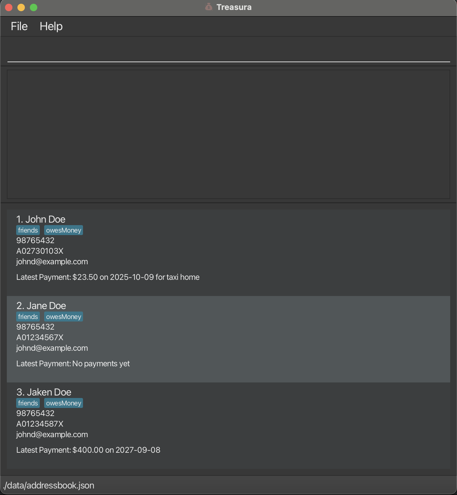
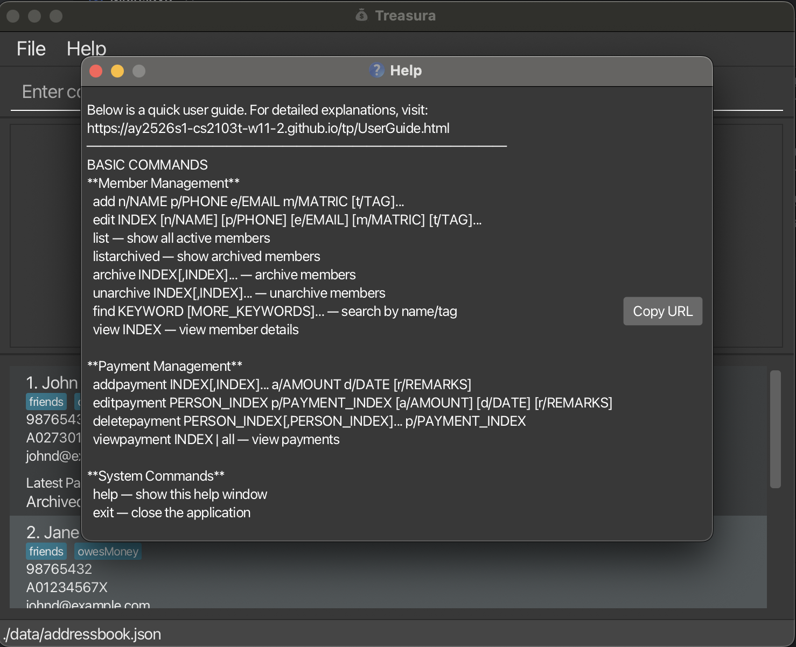

# Treasura User Guide

Treasura is a **desktop app for managing CCA members and payments, optimized for use via a  Line Interface** (CLI) while still having the benefits of a Graphical User Interface (GUI). If you can type fast, Treasura can get your CCA management tasks done faster than traditional GUI apps. 
Treasura is primarily targeted towards CCA leaders and treasurers.

<!-- * Table of Contents -->
<page-nav-print />

--------------------------------------------------------------------------------------------------------------------

## Quick start

1. Ensure you have Java `17` or above installed in your computer.<br>
   **Mac users:** Ensure you have the precise JDK version prescribed [here](https://se-education.org/guides/tutorials/javaInstallationMac.html).

1. Download the latest `.jar` file from [here](https://github.com/AY2526S1-CS2103T-W11-2/tp/releases).

1. Copy the file to the folder you want to use as the _home folder_ for your Treasura.

1. Open a command terminal, `cd` into the folder you put the jar file in, and use the `java -jar treasura.jar` command to run the application.<br>
   A GUI similar to the below should appear in a few seconds. Note how the app contains some sample data.<br>
   

1. Type the command in the command box and press Enter to execute it. e.g. typing **`help`** and pressing Enter will open the help window.<br>
   Some example commands you can try:

   * `list` : Lists all contacts.

   * `add n/John Doe p/98765432 e/johnd@example.com m/A0123456X t/friends t/owesMoney` : Adds a contact named `John Doe` to the Address Book.

   * `archive 3` : Archives the 3rd member shown in the current list.

   * `exit` : Exits the app.

1. Refer to the [Features](#features) below for details of each command.

--------------------------------------------------------------------------------------------------------------------

## Features

<box type="info" seamless>

**Notes about the command format:**<br>

* Words in `UPPER_CASE` are the parameters to be supplied by the user.<br>
  e.g. in `add n/NAME`, `NAME` is a parameter which can be used as `add n/John Doe`.

* Items in square brackets are optional.<br>
  e.g `n/NAME [t/TAG]` can be used as `n/John Doe t/friend` or as `n/John Doe`.

* Items with `…`​ after them can be used multiple times including zero times.<br>
  e.g. `[t/TAG]…​` can be used as ` ` (i.e. 0 times), `t/friend`, `t/friend t/family` etc.

* Parameters can be in any order.<br>
  e.g. if the command specifies `n/NAME p/PHONE_NUMBER`, `p/PHONE_NUMBER n/NAME` is also acceptable.

* Extraneous parameters for commands that do not take in parameters (such as `undo`, `list`, `exit`) will return an error if a parameter is given.<br>
  e.g. if the command specifies `undo 123`, it will cause an error.

<box type="warning" seamless>

**Caution:**
`help` is the one exception to this rule, to provide leeway for unfamiliar users.<br>
</box>

* If you are using a PDF version of this document, be careful when copying and pasting commands that span multiple lines as space characters surrounding line-breaks may be omitted when copied over to the application.
</box>

---

### Viewing help : `help`

Shows a message explaining how to access the help page.



Format: `help`

---

### Adding a person: `add`

Adds a person to the address book.

Format: `add n/NAME p/PHONE_NUMBER e/EMAIL m/MATRICNUM [t/TAG]…​`

* A member's `MATRICNUM` is unique and duplicate entries will not be allowed.

<box type="tip" seamless>

**Tip:** A person can have any number of tags (including 0)
</box>

Examples:
* `add n/John Doe p/98765432 e/johnd@example.com m/A0123456X t/friends t/owesMoney`
* `add n/Jane Doe p/98765432 e/janed@example.com m/A0987632Y t/member t/overdue`

---

### Listing all persons : `list`

* Shows a list of all persons in the address book.
* Any argument will be disregarded in the command and will return an error.

Format: `list`

---
### View member(s): `view`

View details of a member in Treasura.

Format: `view INDEX`

* Displays a summary of details of the member at the specified `INDEX`. This includes: Name, Phone Number, Email address, Matriculation Number, Tags, Archive status.
* For payments, use `viewpayment`

---

### Editing a person : `edit`

Edits an existing person in Treasura.

Format: `edit INDEX [n/NAME] [p/PHONE] [e/EMAIL] [m/MATRIC] [t/TAG]…​`

* Edits the person at the specified `INDEX`. The index refers to the index number shown in the displayed person list. The index **must be a positive integer** 1, 2, 3, …​
* At least one of the optional fields must be provided.
* Existing values will be updated to the input values.
* When editing tags, the existing tags of the person will be removed i.e adding of tags is not cumulative.
* You can remove all the person’s tags by typing `t/` without
    specifying any tags after it.

Examples:
*  `edit 1 p/91234567 e/johndoe@example.com` Edits the phone number and email address of the 1st person to be `91234567` and `johndoe@example.com` respectively.
*  `edit 2 n/Betsy Crower t/` Edits the name of the 2nd person to be `Betsy Crower` and clears all existing tags.

---

### Undoing an action: `undo`

Undoes the most recent mutating action performed in Treasura.

**Format:** `undo`

- Reverses the **last mutating command** (e.g., state-changing commands such as `add`, `edit`, `archive`, `unarchive`, `addpayment`, `editpayment`, `deletepayment`).
- You can `undo` a `redo` (i.e., undoing reverts the re-applied change).
- Non-mutating commands (e.g., `list`, `find`, `help`, `viewpayment`, `findpayment`) **do not** affect the undo history.

**Examples**
```text
add n/Ali p/91234567 e/ali@example.com m/A1234567X
undo                      ← removes the person that was just added
archive 1,2,3
undo                      ← restores the archived members to active
addpayment 1 a/25.00 d/2025-10-21 r/membership
undo                      ← removes the payment just added
```
---

### Redoing an action: `redo`

Reapplies the most recently undone mutating action.

**Format:** `redo`

* Performs the last change that was previously undone using the `undo` command.
* If a new mutating command (e.g., `add`, `edit`, `archive`, `unarchive`, `addpayment`, `deletepayment`) is executed after an `undo`, the redo history is cleared.  
  This prevents redoing outdated actions after the user starts a new timeline.
* Non-mutating commands (e.g., `list`, `find`, `help`, `viewpayment`, `findpayment`) do **not** affect the redo history.

**Examples**
```text
archive 2
undo                      ← restores member 2 to the active list
redo                      ← re-archives member 2 again

addpayment 1 a/50.00 d/2025-10-27
undo
redo                      ← re-applies the payment of $50.00 for person 1
```

---

### Locating persons by name or tag: `find`

Finds persons whose names contain any of the given keywords.

Format: `find KEYWORD [MORE_KEYWORDS]`

* The search is case-insensitive. e.g `hans` will match `Hans`
* The order of the keywords does not matter. e.g. `Hans Bo` will match `Bo Hans`
* Only the name or tag is searched.
* Only full words will be matched for names e.g. `Han` will not match `Hans`
* When finding via tag, any case-insensitive, exact tag matched will be shown e.g. `OWESmoney` will match `owesMoney`, but `owe` will not match `owesMoney`
* Persons matching at least one keyword will be returned (i.e. `OR` search).
  e.g. `Hans Bo` will return `Hans Gruber`, `Bo Yang`
  e.g. `Jane friend` will return all members either with the name `Jane` or with the tag `friend`

<box type="warning" seamless>

**Caution:**
`find` does not return any archived members, even if matching criteria was met.<br>
</box>

Examples:
* `find John` returns `john` and `John Doe`
* `find alex david` returns `Alex Yeoh`, `David Li`<br>
* `find alex family` returns all members with the name alex or the tag `family`
  

---

### Archiving members : `archive`

Deletes the specified person from the address book.

Format: `archive INDEX[,INDEX...]`

* Archives the person at the specified `INDEX`.
* The index refers to the index number shown in the displayed person list.
* The index **must be a positive integer** 1, 2, 3, …​

Examples:
* `list` followed by `archive 2` archives the 2nd person in the address book.
* `find Betsy` followed by `archives 1` archives the 1st person in the results of the `find` command.

<box type="tip" seamless>

**Tip:** Members who have been archived still keep their payment and member details. Their details can be viewed via using `listarchived` and `viewpayment INDEX` or `view INDEX`.
</box>

---

### Listing archived people: `listarchived`

List members who have been archived.

Format: `listarchived`

* Displays a list of archived members
* Any argument will be disregarded in the command and will return an error.

---

### Unarchiving members: `unarchive`

Unarchives the person at the specified `INDEX`

Format: `unarchive INDEX[,INDEX...]`

* The index refers to the index number shown in the displayed person list, after using `listarchived`
* The index **must be a positive integer** 1, 2, 3, …​

Examples:
* `listarchived` followed by `unarchive 2` unarchives the 2nd person in the archived list.
* `listarchived` followed by `unarchive 1,2,4` unarchives the 1st, 2nd and 4th members in the archived list.

---

### Add payment(s): `addpayment`

Adds a payment to the member(s) at the specified `INDEX`

Format: `addpayment INDEX[,INDEX]... a/AMOUNT d/DATE [r/REMARKS]`

* The index refers to the member(s) shown in the current displayed list.
* `a/AMOUNT` is the payment amount in dollars and cents (e.g., 25.00)
* `d/DATE` follows the `YYYY-MM-DD` format.
* `[r/REMARKS]` is optional for short notes such as “Membership Fee” or “CCA Shirt”.

Examples:
* `addpayment 1 a/20.00 d/2025-03-12 r/Membership fee`
* `addpayment 2,3 a/15.50 d/2025-04-01 r/Event T-shirt`

---

### Edit payment(s): `editpayment`

Edits an existing payment record for the specified member.

Format: `editpayment PERSON_INDEX p/PAYMENT_INDEX [a/AMOUNT] [d/DATE] [r/REMARKS]`

* `PERSON_INDEX` is the index of the member.
* `p/PAYMENT_INDEX` refers to the payment number listed in that member’s payment history.
* You can update one or more details: amount, date, or remarks.

Examples:
* `editpayment 1 p/2 a/30.00` — updates payment #2 for member #1 to $30.00.
* `editpayment 3 p/1 r/Corrected to event fee` — changes the remark for payment #1 of member #3.

---

### View payment(s): `viewpayment`

Displays payment details for a specific member, or for all members.

Format: `viewpayment INDEX`  
or  
`viewpayment all`

* Use `viewpayment INDEX` to show all payments made by a single member.
* Use `viewpayment all` to view payments for every member in the system.

Examples:
* `viewpayment 2` — shows all payments made by the 2nd member.
* `viewpayment all` — lists all recorded payments in the address book.

---

### Delete payment(s): `deletepayment`

Deletes an existing payment record from one or more members.

Format: `deletepayment PERSON_INDEX[,PERSON_INDEX]... p/PAYMENT_INDEX`

* `PERSON_INDEX` refers to the member(s).
* `p/PAYMENT_INDEX` refers to the payment number to delete from each listed member.

Examples:
* `deletepayment 1 p/2` — deletes payment #2 for member #1.
* `deletepayment 1,3 p/1` — deletes payment #1 for both members #1 and #3.

<box type="tip" seamless>

**Tip:** `deletepayment` can be reversed if `undo` is performed.
</box>

---

### Exiting the program : `exit`

* Exits the program.
* Any argument will be disregarded in the command and will return an error.

Format: `exit`

---

### Saving the data

AddressBook data are saved in the hard disk automatically after any command that changes the data. There is no need to save manually.

### Editing the data file

AddressBook data are saved automatically as a JSON file `[JAR file location]/data/addressbook.json`. Advanced users are welcome to update data directly by editing that data file.

<box type="warning" seamless>

**Caution:**
If your changes to the data file makes its format invalid, AddressBook will discard all data and start with an empty data file at the next run.  Hence, it is recommended to take a backup of the file before editing it.<br>
Furthermore, certain edits can cause the AddressBook to behave in unexpected ways (e.g., if a value entered is outside the acceptable range). Therefore, edit the data file only if you are confident that you can update it correctly.
</box>


--------------------------------------------------------------------------------------------------------------------

## FAQ

**Q**: How do I transfer my data to another computer?<br>
**A**: Install the app in the other computer and overwrite the empty data file it creates with the file that contains the data of your previous AddressBook home folder.

--------------------------------------------------------------------------------------------------------------------

## Known issues

1. **When using multiple screens**, if you move the application to a secondary screen, and later switch to using only the primary screen, the GUI will open off-screen. The remedy is to delete the `preferences.json` file created by the application before running the application again.
2. **If you minimize the Help Window** and then run the `help` command (or use the `Help` menu, or the keyboard shortcut `F1`) again, the original Help Window will remain minimized, and no new Help Window will appear. The remedy is to manually restore the minimized Help Window.

--------------------------------------------------------------------------------------------------------------------

## Command summary

| Action              | Format                                                                       | Example(s)                                                                         |
|---------------------|------------------------------------------------------------------------------|------------------------------------------------------------------------------------|
| **Add**             | `add n/NAME p/PHONE e/EMAIL m/MATRIC [t/TAG]...`                             | `add n/James Ho p/22224444 e/jamesho@example.com m/A0273010Y t/friend t/treasurer` |
| **Edit**            | `edit INDEX [n/NAME] [p/PHONE] [e/EMAIL] [m/MATRIC] [t/TAG]...`              | `edit 2 n/James Lee e/jameslee@example.com`                                        |
| **Undo**            | `undo`                                                                       | `undo`                                                                             |
| **Redo**            | `redo`                                                                       | `redo`                                                                             |
| **Find**            | `find KEYWORD [MORE_KEYWORDS]...`                                            | `find James treasurer`                                                             |
| **List**            | `list`                                                                       | `list`                                                                             |
| **List Archived**   | `listarchived`                                                               | `listarchived`                                                                     |
| **Archive**         | `archive INDEX[,INDEX]...`                                                   | `archive 1,2,5`                                                                    |
| **Unarchive**       | `unarchive INDEX[,INDEX]...`                                                 | `unarchive 2,5`                                                                    |
| **View Member**     | `view INDEX`                                                                 | `view 4`                                                                           |
| **Add Payment**     | `addpayment INDEX[,INDEX]... a/AMOUNT d/DATE [r/REMARKS]`                    | `addpayment 1,3 a/25.00 d/2025-10-24 r/Monthly dues`                               |
| **Edit Payment**    | `editpayment PERSON_INDEX p/PAYMENT_INDEX [a/AMOUNT] [d/DATE] [r/REMARKS]`   | `editpayment 2 p/1 a/30.00 r/Corrected`                                            |
| **Delete Payment**  | `deletepayment PERSON_INDEX[,PERSON_INDEX]... p/PAYMENT_INDEX`               | `deletepayment 1,3 p/2`                                                            |
| **View Payment(s)** | `viewpayment INDEX` or `viewpayment all`                                     | `viewpayment 2`, `viewpayment all`                                                 |
| **Help**            | `help`                                                                       | `help`                                                                             |

---

### Glossary

* Member = A NUS student part of a CCA
* Matriculation number = A unique ID given to all NUS students. Starts with A, followed by 7 digits and ending with any upper case letter.
* JSON = A file format used to store Treasura data.


